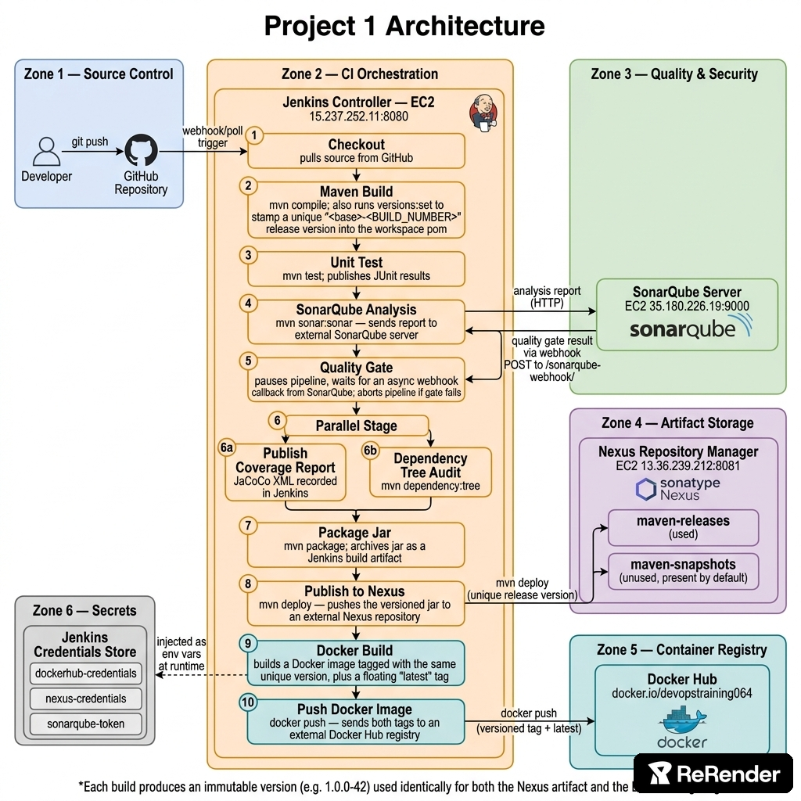

# Architecture — Project 1: Enterprise CI Pipeline

This project adds a Continuous Integration pipeline in front of the base
application from `main`. No backend code changes — the backend is
identical to `main`; only build/quality/packaging automation is new.

See [`pipeline-diagram.md`](./pipeline-diagram.md) for the full Mermaid
flow diagram of every Jenkinsfile stage.

## Why there's no frontend here

This pipeline's whole job is CI for the backend: build, test, quality
gate, package, publish to Nexus, build and push a Docker image. None of
that touches the frontend, so `frontend/` source, `docker/frontend.Dockerfile`,
and the `frontend` service in `docker-compose.yml` were removed from this
branch entirely — local dev here is backend+mysql only.
`project-03-cicd-helm-microservices` is where frontend and backend both
get their own independent CI/CD pipelines.

## What's new vs. `main`

| Added | Purpose |
|---|---|
| `Jenkinsfile` | Orchestrates the whole CI flow |
| `docker/backend-ci.Dockerfile` | Packages the Jenkins-built jar (no rebuild inside Docker) |
| `jenkins/` | Controller setup docs, plugin list, Maven settings template |
| `sonar-maven-plugin` in `backend/pom.xml` | Enables `mvn sonar:sonar` |

## Why the CI Dockerfile differs from the dev one

`docker/backend.Dockerfile` (from `main`) is a multi-stage build that runs
Maven *inside* Docker — convenient for `docker compose up` on a laptop where
nothing is pre-built. In a CI pipeline that's wasteful and risky: Jenkins
already compiled, tested, and packaged the jar in the "Package Jar" stage,
so rebuilding it again inside Docker means testing a different artifact
than the one that will actually ship. `backend-ci.Dockerfile` just takes the
already-validated jar and wraps it in a minimal runtime image.

## Why Quality Gate is a separate stage from SonarQube Analysis

`sonar:sonar` submits the analysis and returns immediately — SonarQube
computes the quality gate result asynchronously and calls back via webhook.
Splitting them lets the pipeline show a clean "Quality Gate" stage in the
Blue Ocean / classic stage view distinctly from the (fast) analysis
submission, and lets `waitForQualityGate` time out independently.
