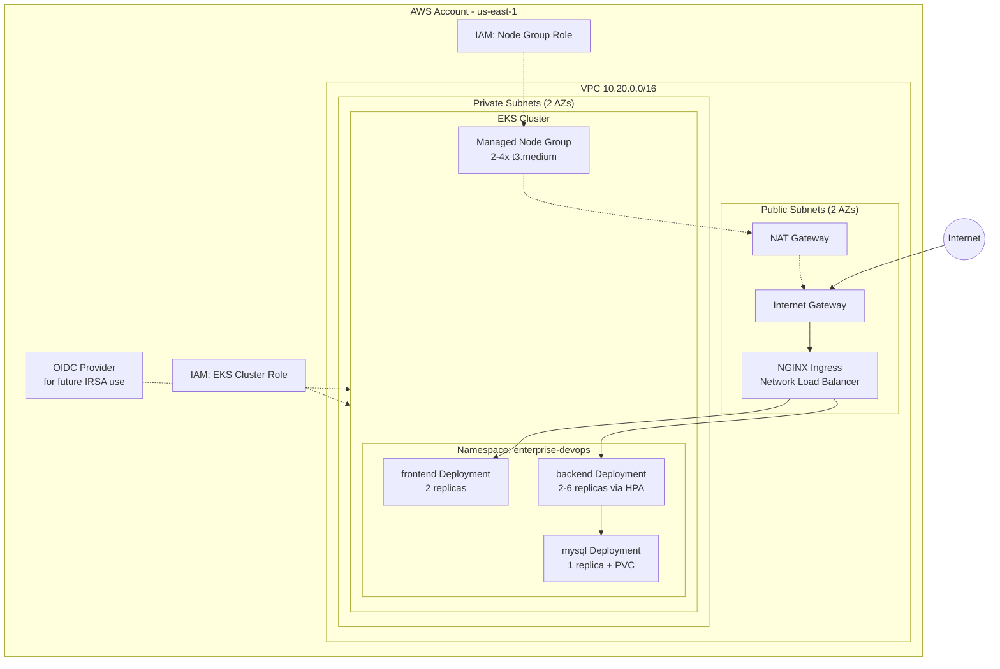

# AWS Infrastructure — Project 2

What `terraform/` provisions, and how the deployed application sits inside it.

## Why one NAT Gateway instead of one per AZ

A production deployment typically runs one NAT Gateway per AZ so an AZ
failure doesn't take down outbound internet access for the other AZ's
nodes. This project uses a single shared NAT Gateway to keep the
per-hour cost of running the learning environment down — see
`terraform/modules/vpc/main.tf` for exactly where you'd change this
(duplicate the `aws_nat_gateway` resource per AZ and adjust the private
route tables to match).

## Why worker nodes are private-subnet-only

Standard EKS best practice: nodes have no direct route from the internet;
all inbound traffic arrives through the Ingress-provisioned Load Balancer
in the public subnets. Reduces the attack surface to exactly one
internet-facing entry point.

Full pipeline diagram (including the new Deploy/Verify stages):
[`pipeline-diagram.md`](./pipeline-diagram.md).
