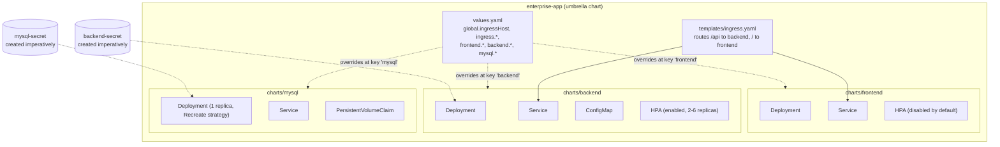

# Helm Chart Structure — Project 3

## Values precedence

For any given key, Helm resolves in this order (highest wins):

1. `--set` flags on the CLI (what both Jenkinsfiles use for `image.tag`)
2. `-f <file>.yaml` overlays (e.g. `values-prod.yaml.example`)
3. The umbrella chart's own `values.yaml` (keys `frontend:`, `backend:`,
   `mysql:`, `global:`)
4. Each subchart's own `values.yaml` defaults

This is why `backend/values.yaml` can set a `global: { ingressHost: ... }`
default (so the chart also works installed standalone) while the umbrella
`values.yaml`'s `global.ingressHost` — one level higher in precedence —
is what actually wins whenever `enterprise-app` is installed as a whole.

## Why `mysql`/`backend`/`frontend` are fixed names, not release-prefixed

Each subchart's `_helpers.tpl` returns a constant name (`mysql`, `backend`,
`frontend`) instead of the usual `{{ .Release.Name }}-<chart>` "fullname"
convention. This is a deliberate simplification, not an oversight — see
the comment in `helm/enterprise-app/charts/mysql/templates/_helpers.tpl`.
It keeps `backend`'s `DB_URL` (`jdbc:mysql://mysql:3306/...`) stable
without needing cross-chart value threading, at the cost of only
supporting one `enterprise-app` release per namespace. A chart meant for
multiple parallel releases (e.g. per-PR preview environments) would need
to template these names properly.
