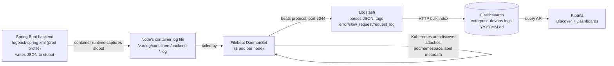

# Log Flow — Project 5

## What actually generates each log category

| Category | Source | How to find it in Kibana |
|---|---|---|
| Application Logs | Any `log.info(...)` call across the codebase | `app.logger_name` |
| Request Logs | `RequestLoggingFilter` — one line per HTTP request | tag `request_log` |
| Slow Requests | Same filter, when duration exceeds `SLOW_REQUEST_THRESHOLD_MS` | tag `slow_request` |
| Error Logs | `GlobalExceptionHandler.handleGeneric` (ERROR, with stack trace) | `app.level: ERROR` or tag `error_log` |
| Exception Logs | Same handler — the full stack trace is in `app.stack_trace` | tag `error_log` |

See `backend/src/main/java/.../filter/RequestLoggingFilter.java` and
`backend/src/main/java/.../exception/GlobalExceptionHandler.java` for the
actual logging calls, and `logging/elk-stack/charts/logstash/templates/configmap.yaml`
for the pipeline that tags them.

## Why this only ships from the `prod`/non-dev profile

`logback-spring.xml` uses a human-readable plain-text pattern in the `dev`
Spring profile and JSON (`LogstashEncoder`) everywhere else. Local
development never sends logs through Filebeat, so there's no reason to
sacrifice readability there — the JSON format specifically serves the ELK
pipeline, which only runs against cluster deployments.

## Independence from the application's own GitOps flow

Notice nothing in this diagram touches `backend/Jenkinsfile` or
`gitops/applications/enterprise-app.yaml`. The logging pipeline observes
whatever the application emits; it never needs to know about a deploy
happening, an image tag changing, or a pod restarting — it just keeps
tailing whatever container is currently running. This is why `elk-stack`
is its own Argo CD Application (`gitops/applications/logging-stack.yaml`)
with its own sync policy, entirely decoupled from `enterprise-app`'s.
