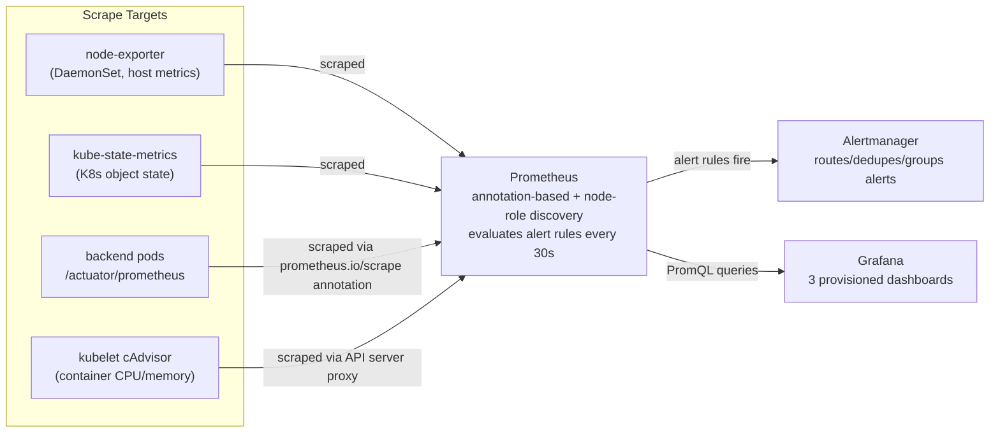
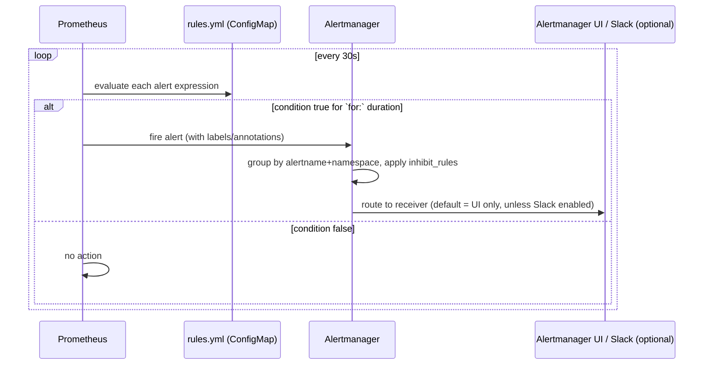

# Metrics Flow — Project 6

## How Prometheus finds each target (no Operator, no CRDs)

| Target | Discovery mechanism | Config location |
|---|---|---|
| Backend pods | `role: pod` + `prometheus.io/scrape` annotation | `helm/enterprise-app/charts/backend/templates/deployment.yaml` (annotation) + `monitoring/monitoring-stack/charts/prometheus/templates/configmap.yaml` (job) |
| kube-state-metrics | Static target (fixed Service name/port) | same configmap, `kube-state-metrics` job |
| node-exporter | Static target (fixed Service name/port) | same configmap, `node-exporter` job |
| Container CPU/memory (cAdvisor) | `role: node` + API server proxy path | same configmap, `kubernetes-nodes-cadvisor` job |

## Alert evaluation and routing

## Dashboards

Three, covering the six categories the project's learning goals name
(Cluster, Namespace, Application, Node, JVM, Spring Boot) by grouping the
closely-related ones together:

| Dashboard | Covers |
|---|---|
| Cluster & Node Dashboard | Cluster-wide node count/pod count, per-node CPU/memory/disk/network |
| Namespace & Pod Dashboard | Pods per namespace, deployment availability, restarts, per-pod CPU/memory |
| Application (Spring Boot / JVM) Dashboard | HTTP request rate/latency/availability, JVM heap/threads/GC, DB connection pool |

See `monitoring/monitoring-stack/charts/grafana/templates/configmap-dashboard-*.yaml`
for the actual panel definitions and PromQL queries.

## Independence from the other two Argo CD Applications

Like `logging-stack` (Project 5), `monitoring-stack` is its own Argo CD
Application, in its own `monitoring` namespace, with no `selfHeal` given
its own persistent volumes (Prometheus's TSDB, Alertmanager's silence
state, Grafana's dashboards/sessions). It observes `enterprise-app` and
(via the backend's `prometheus.io/scrape` annotation) the application
tier specifically, but neither Application has any Kubernetes-level
dependency on the other — each can be installed, upgraded, or removed
independently.
