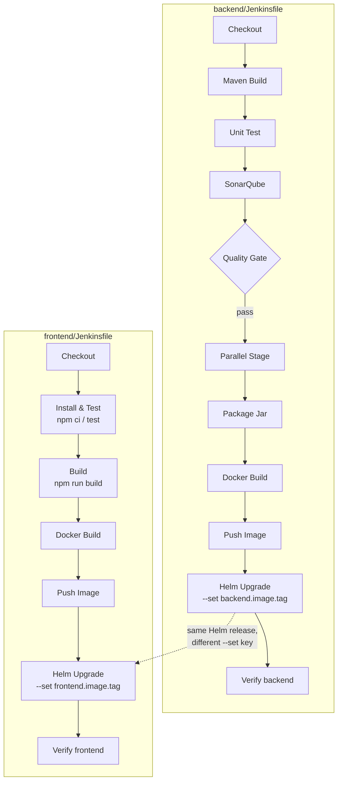
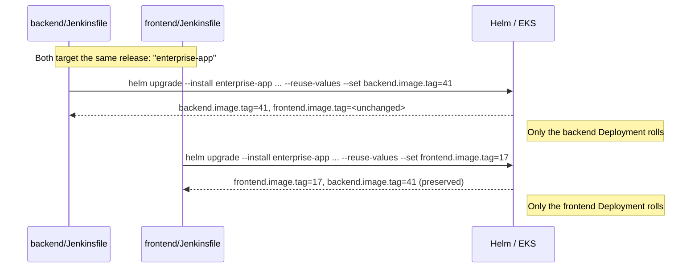

# CI/CD Pipeline Diagrams — Project 3

Two fully independent pipelines now — `backend/Jenkinsfile` and
`frontend/Jenkinsfile` — replacing the single root `Jenkinsfile` from
Projects 1-2. Each can build, test, and deploy without waiting on, or
being blocked by, the other.

## Why splitting pipelines matters (the actual lesson)

In Project 2's single Jenkinsfile, a frontend-only CSS tweak still had to
wait for the *entire* backend build/test/SonarQube/quality-gate chain
before anything deployed — and a red backend Quality Gate blocked an
unrelated frontend fix from shipping. Splitting into two pipelines, each
touching only its own Helm values key via `--reuse-values`, means:

- A frontend change deploys in the time it takes to `npm test` + build a
  static bundle — no Java toolchain, no SonarQube wait.
- A failing backend Quality Gate never blocks a frontend release, and
  vice versa.
- Each pipeline's blast radius is exactly one Helm value
  (`backend.image.tag` or `frontend.image.tag`) — `--reuse-values` is what
  guarantees pipeline A never clobbers pipeline B's last successful value.

## Helm release lifecycle across both pipelines

Full Helm chart structure: [`helm-chart-structure.md`](./helm-chart-structure.md).
