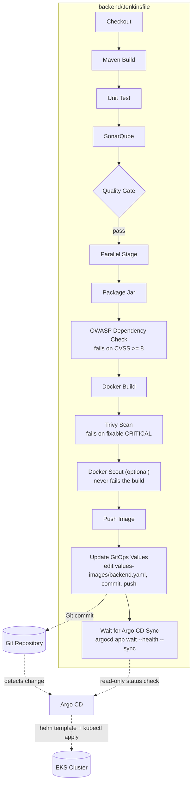
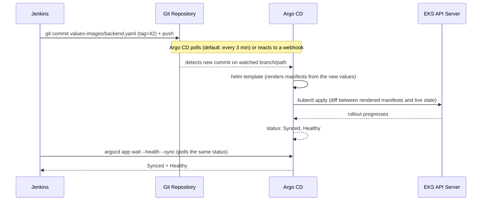
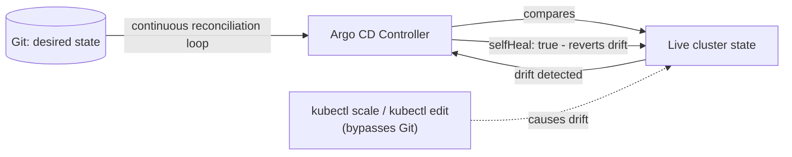

# GitOps Pipeline Diagrams — Project 4

Same two independent pipelines as Project 3, but each now ends at a Git
commit instead of a direct cluster deploy. Argo CD, not Jenkins, is what
actually talks to the Kubernetes API for application resources.

## The actual deploy path (not Jenkins)

Compare this to Project 3's sequence diagram (same file, previous branch)
where Jenkins itself called `helm upgrade` — here Jenkins never has
`kubectl`/cluster credentials at all. `argocd app wait` is a read-only
status check against the Argo CD API, not a deploy action.

## Self-healing / desired-state reconciliation

See `scripts/simulate-self-heal.sh` and `docs/04-Step-by-Step.md` for a
hands-on exercise proving this loop actually works, not just describing it.
