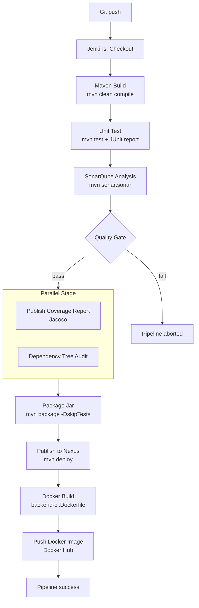
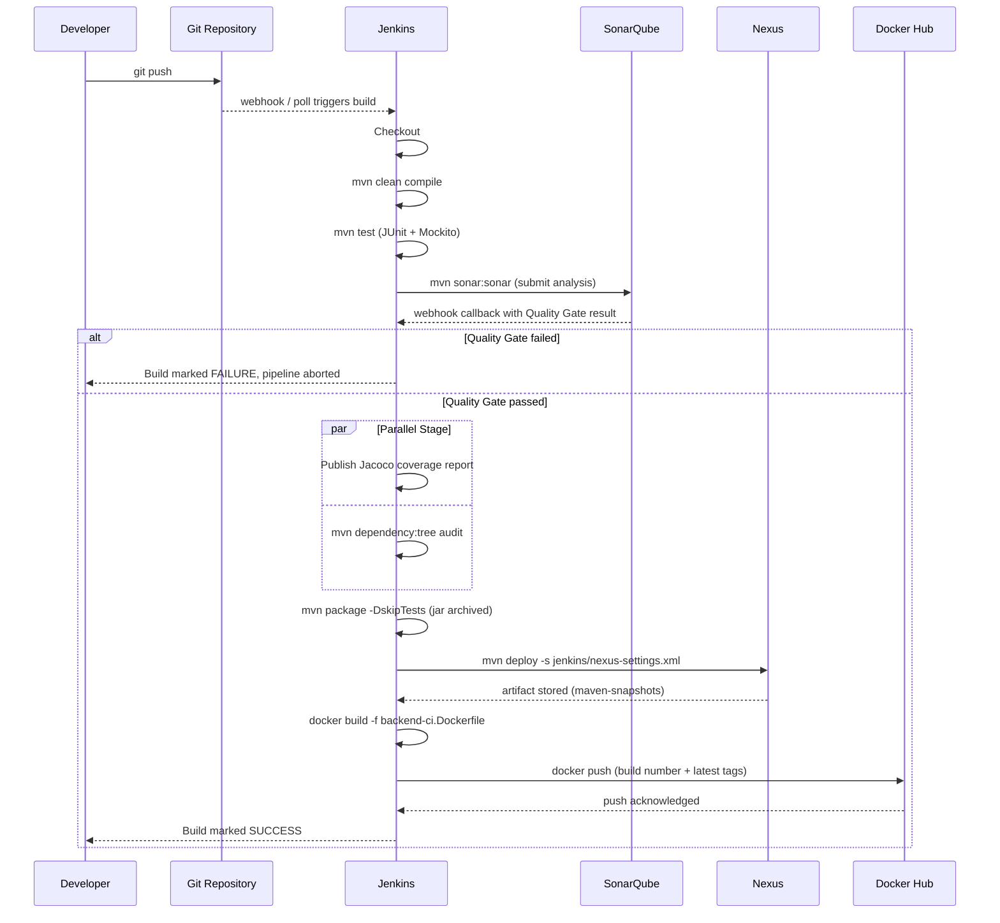

# CI Pipeline Diagram — Project 1

```mermaid
flowchart TD
    A[Git push] --> B[Jenkins: Checkout]
    B --> C[Maven Build<br/>mvn clean compile]
    C --> D[Unit Test<br/>mvn test + JUnit report]
    D --> E[SonarQube Analysis<br/>mvn sonar:sonar]
    E --> F{Quality Gate}
    F -- fail --> X[Pipeline aborted]
    F -- pass --> G[Parallel Stage]

    subgraph G[Parallel Stage]
        direction LR
        G1[Publish Coverage Report<br/>Jacoco]
        G2[Dependency Tree Audit]
    end

    G --> H[Package Jar<br/>mvn package -DskipTests]
    H --> H2[Publish to Nexus<br/>mvn deploy]
    H2 --> I[Docker Build<br/>backend-ci.Dockerfile]
    I --> J[Push Docker Image<br/>Docker Hub]
    J --> K[Pipeline success]
```

## Stage-by-stage detail

```mermaid
sequenceDiagram
    participant Dev as Developer
    participant GH as Git Repository
    participant J as Jenkins
    participant SQ as SonarQube
    participant NX as Nexus
    participant DH as Docker Hub

    Dev->>GH: git push
    GH-->>J: webhook / poll triggers build
    J->>J: Checkout
    J->>J: mvn clean compile
    J->>J: mvn test (JUnit + Mockito)
    J->>SQ: mvn sonar:sonar (submit analysis)
    SQ-->>J: webhook callback with Quality Gate result
    alt Quality Gate failed
        J-->>Dev: Build marked FAILURE, pipeline aborted
    else Quality Gate passed
        par Parallel Stage
            J->>J: Publish Jacoco coverage report
        and
            J->>J: mvn dependency:tree audit
        end
        J->>J: mvn package -DskipTests (jar archived)
        J->>NX: mvn deploy -s jenkins/nexus-settings.xml
        NX-->>J: artifact stored (maven-snapshots)
        J->>J: docker build -f backend-ci.Dockerfile
        J->>DH: docker push (build number + latest tags)
        DH-->>J: push acknowledged
        J-->>Dev: Build marked SUCCESS
    end
```
