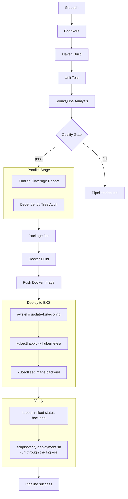
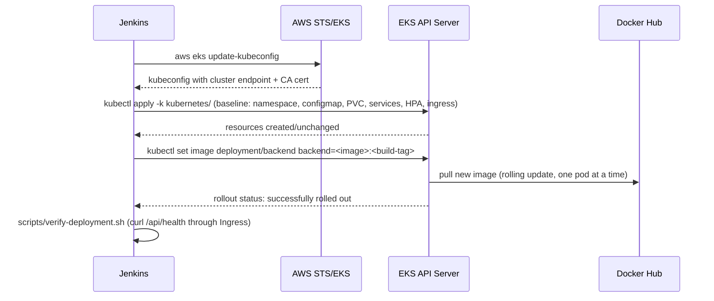

# CI/CD Pipeline Diagram — Project 2

Extends Project 1's pipeline (Checkout through Package Jar are unchanged)
with a real deployment to EKS.

## Deploy stage detail

Why `kubectl apply -k` runs *before* `kubectl set image`: the baseline
apply is what actually creates the namespace/configmap/services/HPA/PVC
if they don't already exist (first deploy) or reconciles drift (later
deploys); `set image` only ever touches the container image field on an
existing Deployment, so it must run second.
