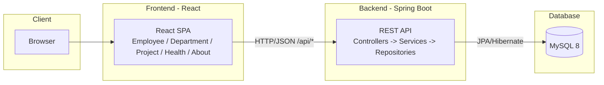
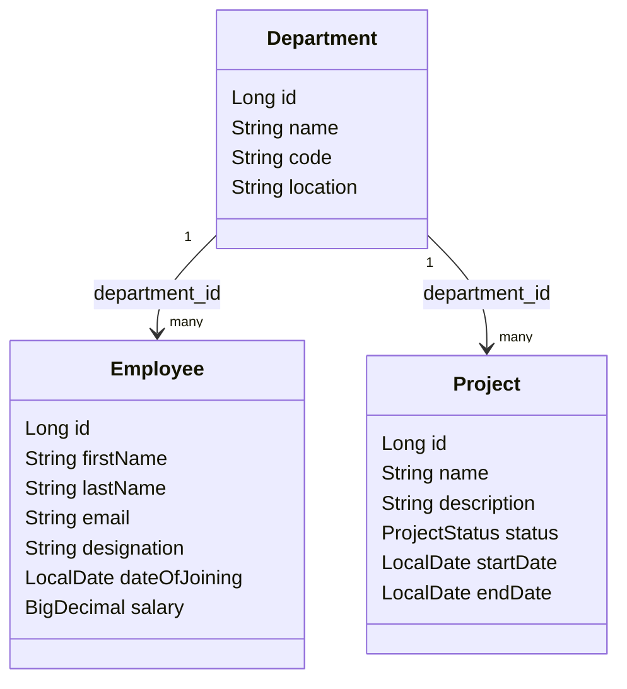
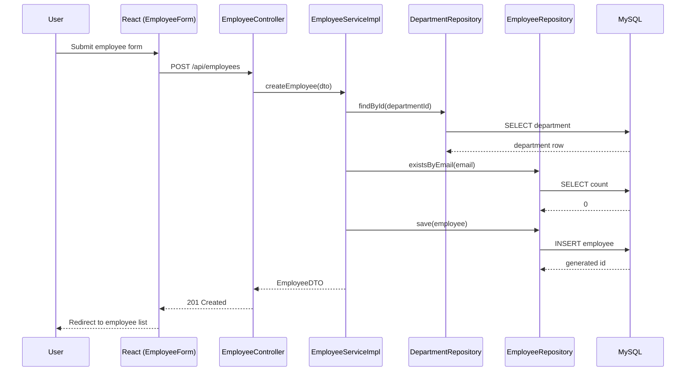

# Application Architecture (main branch)

This is the baseline architecture of the application before any DevOps tooling
is layered on top in the project branches.

## Module map

## Request flow (Employee CRUD example)

This diagram evolves in every subsequent project branch — see each
branch's `docs/02-Architecture.md` for the updated picture (CI pipeline,
EKS deployment, Helm release, GitOps flow, logging pipeline, monitoring
stack).
