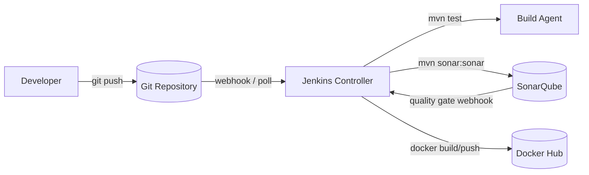

# Architecture — Project 1: Enterprise CI Pipeline

Full detail lives in [`/architecture`](../architecture/README.md) — this
page is the short version.

The application architecture is unchanged from `main`
([`/diagrams/application-architecture.md`](../diagrams/application-architecture.md)).
What's added here sits entirely *around* the app:

## Key design decisions

- **No app code changes.** The Jenkinsfile builds and tests exactly what's
  in `backend/` — CI should validate the app, not shape it.
- **Quality Gate can fail the build.** `waitForQualityGate abortPipeline:
  true` means a coverage or duplication regression stops the pipeline
  before an image is ever built, let alone pushed.
- **The CI Docker image differs from the dev Docker image** — see
  [`architecture/README.md`](../architecture/README.md#why-the-ci-dockerfile-differs-from-the-dev-one)
  for why building the jar twice (once via Maven, again inside a
  multi-stage Dockerfile) would be wasteful and risks testing a different
  artifact than what ships.
- **Credentials never live in the repo.** Docker Hub credentials come from
  Jenkins' credential store (`dockerhub-credentials`); SonarQube auth comes
  from the SonarQube server config in Jenkins, not a token in
  `settings.xml`.

## Next

Continue to [03-Installation.md](./03-Installation.md).
