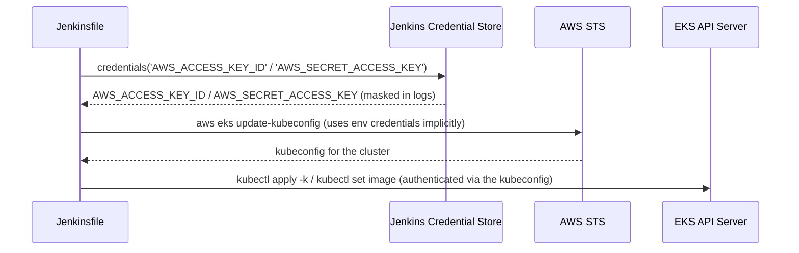
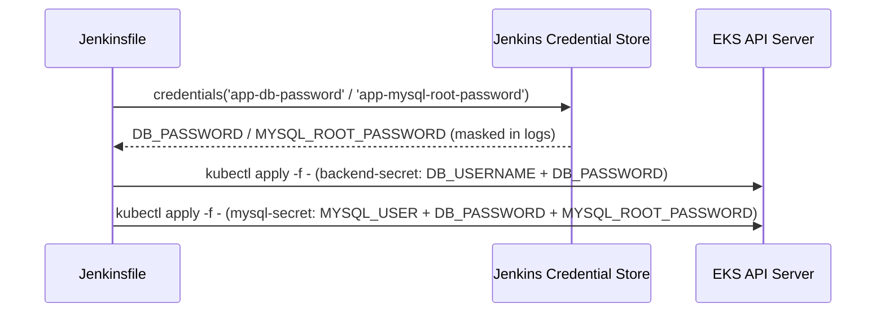

# Pipeline & Deploy Flow — Project 2: CD to AWS EKS

Full diagrams: [`/architecture/pipeline-diagram.md`](../architecture/pipeline-diagram.md).

## New stages vs. Project 1

| Stage | Command | Fails the build if... |
|---|---|---|
| Docker Build | `docker build` | Dockerfile fails |
| Push Docker Image | `docker push` (x2 tags) | Docker Hub auth/network failure |
| Deploy to EKS | `aws eks update-kubeconfig` → `kubectl apply -k` → (re)create `backend-secret`/`mysql-secret` → `kubectl set image` | AWS auth failure, cluster unreachable, invalid manifest |
| Verify | `kubectl rollout status`, then `scripts/verify-deployment.sh` | Rollout doesn't complete in 180s, or the smoke test curl fails |

## Why the image tag includes the release version

`IMAGE_TAG` is the backend's `pom.xml` version plus the Jenkins build
number (e.g. `1.0.0-42`), the same technique used in
`project-01-ci-pipeline`'s Jenkinsfile — a build number alone traces back
to a Jenkins run, but pairing it with the actual release version makes
the tag meaningful on its own, e.g. in `docker images` or a rollback
command.

## Why `kubectl apply -k` then `kubectl set image` (not one step)

`kubectl apply -k kubernetes/` is declarative and idempotent — it
reconciles the *shape* of the cluster (namespace exists, configmap is
current, services/HPA/ingress exist) but the `images:` block in
`kustomization.yaml` only pins a fallback tag (`latest`). `kubectl set
image` then does one focused, auditable thing: point the Deployment at
this specific build's image. Splitting these means a manifest change
(e.g. adjusting HPA thresholds) and an image bump are always independently
diagnosable in `kubectl rollout history`.

## Rolling update mechanics

The backend Deployment manifest doesn't set a custom `strategy`, so it
uses Kubernetes' default `RollingUpdate` (`maxUnavailable: 25%, maxSurge:
25%`). Combined with its `readinessProbe`, this is what makes the
zero-downtime behavior in `docs/04-Step-by-Step.md` step 5 work:
Kubernetes won't route traffic to a new pod, or terminate an old one, until
the readiness probe says so.

## Credential flow (new: AWS)

## Credential flow (new: app database secrets)

`backend-secret`/`mysql-secret` are never committed (see
`kubernetes/secret.example.yaml`) and don't exist on a freshly-created
cluster. Rather than a manual `kubectl create secret` step someone has to
remember after every `terraform apply`, "Deploy to EKS" (re)creates them
on every single deploy, via `kubectl create ... --dry-run=client -o yaml |
kubectl apply -f -` — idempotent, so this is a silent no-op once they
already exist with the same values.

`DB_PASSWORD` is intentionally the *same* value in both secrets — the
backend authenticates to mysql as `devops_user`, and mysql's own
`MYSQL_USER`/`MYSQL_PASSWORD` env vars are what actually create that user.
Different values in each secret means the backend can never connect, with
no error until you actually watch the pod fail to reach the database.

## Next

Continue to [06-Troubleshooting.md](./06-Troubleshooting.md).
