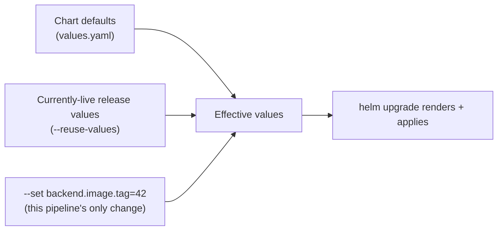

# Pipeline & Helm Flow — Project 3

Full diagrams: [`/architecture/pipeline-diagram.md`](../architecture/pipeline-diagram.md)
and [`/architecture/helm-chart-structure.md`](../architecture/helm-chart-structure.md).

## Backend pipeline stages

| Stage | Command |
|---|---|
| Checkout → Package Jar | Identical to Project 1/2's backend stages |
| Docker Build | `docker build -f docker/backend-ci.Dockerfile` |
| Push Image | `docker push` x2 tags |
| Package & Push Helm Chart | `helm package` + `helm push` to `oci://registry-1.docker.io/devopstraining064` |
| Helm Upgrade | `helm upgrade --install ... --reuse-values --set backend.image.tag=<version>-<build>` |
| Verify | `kubectl rollout status deployment/backend`, then `scripts/verify-backend.sh` |

## Frontend pipeline stages

| Stage | Command |
|---|---|
| Install & Test | `npm ci && npm test` |
| Build | `npm run build` |
| Docker Build | `docker build -f docker/frontend-ci.Dockerfile` |
| Push Image | `docker push` x2 tags |
| Package & Push Helm Chart | `helm package` + `helm push` to `oci://registry-1.docker.io/devopstraining064` |
| Helm Upgrade | `helm upgrade --install ... --reuse-values --set frontend.image.tag=<version>-<build>` |
| Verify | `kubectl rollout status deployment/frontend`, then `scripts/verify-frontend.sh` |

## Why each pipeline stamps its own version

`IMAGE_TAG` is `<manifest version>-<this job's build number>` — the
backend pipeline reads it from `backend/pom.xml`, the frontend pipeline
from `frontend/package.json` (via `node -p`). Unlike Project 1/2, where
one Jenkins job produced one shared tag for everything it built, these
are now two entirely separate Jenkins jobs with their own independent
`BUILD_NUMBER` counters — there's no single shared build to tag against,
so each pipeline versions itself from its own source of truth instead.

## Why `--reuse-values` is the load-bearing flag in this whole project

Without it, every `helm upgrade` would reset to `helm/enterprise-app/values.yaml`
defaults for everything you don't explicitly `--set` — including the
*other* pipeline's last deployed image tag. `--reuse-values` tells Helm
"start from what's currently live, not from the chart's defaults," so
`backend/Jenkinsfile`'s upgrade only ever changes `backend.image.tag` and
leaves `frontend.image.tag` exactly as `frontend/Jenkinsfile` last set it.

This is the Helm-native answer to the same problem Project 2 solved with
`kubectl set image` (a targeted single-field update) — same goal, chart-
based mechanism.

## Values resolution at upgrade time

`--set` always wins over `--reuse-values`, which always wins over chart
defaults for any key it actually carries forward.

## Next

Continue to [06-Troubleshooting.md](./06-Troubleshooting.md).
