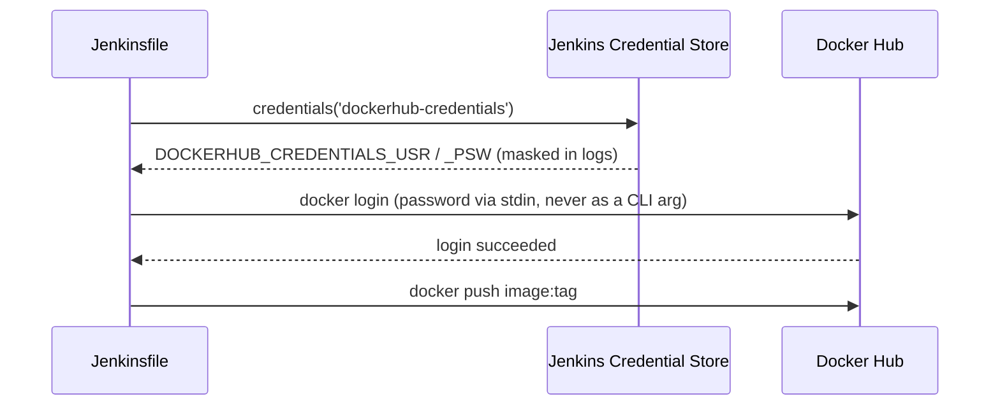

# Pipeline Flow — Project 1: Enterprise CI Pipeline

Full diagrams: [`/architecture/pipeline-diagram.md`](../architecture/pipeline-diagram.md).

## Stage-by-stage

| Stage | Command | Fails the build if... |
|---|---|---|
| Checkout | `checkout scm` | Repo unreachable / bad credentials |
| Maven Build | `mvn clean compile` | Code doesn't compile |
| Unit Test | `mvn test` | Any JUnit/Mockito test fails |
| SonarQube Analysis | `mvn sonar:sonar` | SonarQube server unreachable (analysis itself doesn't "fail" on code smells) |
| Quality Gate | `waitForQualityGate abortPipeline: true` | Coverage/duplication/new-issue thresholds breached, or 10-minute timeout with no webhook response |
| Parallel Stage | Jacoco publish + `mvn dependency:tree` | Either branch erroring |
| Package Jar | `mvn package -DskipTests` | Packaging error (tests already ran, no need to re-run) |
| Publish to Nexus | `mvn deploy -s jenkins/nexus-settings.xml` | Bad Nexus credentials, unreachable Nexus, or repo doesn't allow the redeploy (see `docs/06-Troubleshooting.md`) |
| Docker Build | `docker build -f docker/backend-ci.Dockerfile` | Missing jar, Dockerfile syntax error |
| Push Docker Image | `docker push` (x2 tags) | Bad Docker Hub credentials, network failure |

## Why `-DskipTests` on Package Jar

Tests already ran and were verified in the **Unit Test** stage. Re-running
them during packaging would double the pipeline's total time for zero new
information — `-DskipTests` skips test *execution* while still requiring
test *code* to compile (unlike `-Dmaven.test.skip=true`, which skips both).

## Credential flow

Passwords are piped via stdin (`echo "$PSW" | docker login ... --password-stdin`)
rather than passed as a `-p` flag, which would leak into `ps` output and
shell history on the agent.

The Nexus deploy stage uses the same `credentials()`-injects-env-vars
pattern, but resolves them one hop further: Jenkins sets
`NEXUS_CREDENTIALS_USR`/`_PSW`, and `jenkins/nexus-settings.xml` (passed
via `mvn -s`) references them as `${env.NEXUS_CREDENTIALS_USR}` —
Maven's settings.xml supports `${env.X}` interpolation natively, so no
credential ever needs to be written to a file, only referenced by name.

## Next

Continue to [06-Troubleshooting.md](./06-Troubleshooting.md).
