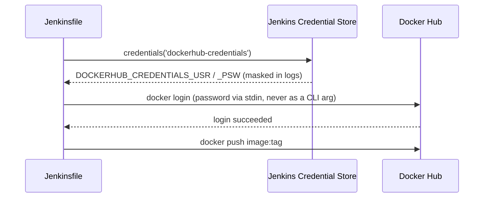

# Pipeline Flow — Project 1: Enterprise CI Pipeline

Full diagrams: [`/architecture/pipeline-diagram.md`](../architecture/pipeline-diagram.md).

## End-to-end flow, point by point

1. Developer pushes a commit to the GitHub repo.
2. Jenkins picks it up (webhook or poll) and checks out the source.
3. Maven compiles the backend, then stamps a unique, immutable release
   version (`<pom base version>-<Jenkins build number>`) into the
   workspace copy of `pom.xml` — this version is reused by every later
   stage.
4. `mvn test` runs the JUnit/Mockito suite; results are published to
   Jenkins' Test Result page.
5. `mvn sonar:sonar` submits a code analysis report to SonarQube.
6. Jenkins pauses on **Quality Gate** and waits for SonarQube to call back
   via webhook with a pass/fail result — the build is aborted here if the
   gate fails.
7. Two independent checks run in parallel: publishing the JaCoCo coverage
   report to Jenkins, and auditing the Maven dependency tree.
8. The jar is packaged (tests already ran, so this step doesn't re-run
   them) and archived as a Jenkins build artifact.
9. The same jar is deployed to Nexus's `maven-releases` repository under
   the version stamped in step 3.
10. A Docker image is built from that jar and tagged with the same
    version, plus a floating `latest` tag.
11. Both tags are pushed to Docker Hub, bracketed by an explicit
    `docker login` (password piped via stdin) and `docker logout`.

## What's in the Jenkinsfile itself

- **`agent any`** — run on any available Jenkins agent (single-agent setup
  here, so this is mostly a placeholder for future scaling).
- **`tools`** — pins the JDK (`java21`) and Maven (`maven3.9.16`)
  installations by the exact names configured in Manage Jenkins → Tools,
  so the build doesn't depend on whatever happens to be on the agent's
  `PATH`.
- **`options`** — `timestamps()` for readable logs, `buildDiscarder` to
  keep only the last 20 builds, `disableConcurrentBuilds()` so two pushes
  in quick succession don't race each other's Docker tags, and a
  45-minute overall `timeout` as a safety net.
- **`environment`** — injects both the Docker Hub and Nexus credentials
  (as `_USR`/`_PSW` env var pairs), names the configured SonarQube server,
  and fixes the Docker Hub image name.
- **`stages`** — the 10 stages covered in the table below, run in order;
  a declarative pipeline stops at the first failed stage by default, so
  everything after a failure is skipped rather than partially run.
- **`post`** — always cleans the workspace; prints the published image
  name on success, or points at the troubleshooting doc on failure.

## Stage-by-stage

| Stage | Command | Fails the build if... |
|---|---|---|
| Checkout | `checkout scm` | Repo unreachable / bad credentials |
| Maven Build | `mvn help:evaluate` + `versions:set` + `mvn clean compile` | Code doesn't compile |
| Unit Test | `mvn test` | Any JUnit/Mockito test fails |
| SonarQube Analysis | `mvn sonar:sonar` | SonarQube server unreachable (analysis itself doesn't "fail" on code smells) |
| Quality Gate | `waitForQualityGate abortPipeline: true` | Coverage/duplication/new-issue thresholds breached, or 10-minute timeout with no webhook response |
| Parallel Stage | Jacoco publish + `mvn dependency:tree` | Either branch erroring |
| Package Jar | `mvn package -DskipTests` | Packaging error (tests already ran, no need to re-run) |
| Publish to Nexus | `mvn deploy -s jenkins/nexus-settings.xml` | Bad Nexus credentials, unreachable Nexus, or repo doesn't allow the redeploy (see `docs/06-Troubleshooting.md`) |
| Docker Build | `docker build -f docker/backend-ci.Dockerfile` | Missing jar, Dockerfile syntax error |
| Push Docker Image | `docker login` + `docker push` (x2 tags) + `docker logout` | Bad Docker Hub credentials, network failure |

## Why the Maven Build stage stamps a version

`backend/pom.xml` keeps a floating `1.0.0-SNAPSHOT` dev version in git.
The Maven Build stage reads that, strips `-SNAPSHOT`, appends the Jenkins
build number (e.g. `1.0.0-42`), and writes it into the **workspace copy**
of the pom via `mvn versions:set` — nothing is committed back to git.
Every later stage (package, deploy, docker build/push) runs against that
already-stamped pom, so the Nexus artifact and the Docker image tag are
always identical and traceable back to the exact build that produced them.

## Why `-DskipTests` on Package Jar

Tests already ran and were verified in the **Unit Test** stage. Re-running
them during packaging would double the pipeline's total time for zero new
information — `-DskipTests` skips test *execution* while still requiring
test *code* to compile (unlike `-Dmaven.test.skip=true`, which skips both).

## Credential flow

Passwords are piped via stdin (`echo "$PSW" | docker login ... --password-stdin`)
rather than passed as a `-p` flag, which would leak into `ps` output and
shell history on the agent.

The Nexus deploy stage uses the same `credentials()`-injects-env-vars
pattern, but resolves them one hop further: Jenkins sets
`NEXUS_CREDENTIALS_USR`/`_PSW`, and `jenkins/nexus-settings.xml` (passed
via `mvn -s`) references them as `${env.NEXUS_CREDENTIALS_USR}` —
Maven's settings.xml supports `${env.X}` interpolation natively, so no
credential ever needs to be written to a file, only referenced by name.

## Next

Continue to [06-Troubleshooting.md](./06-Troubleshooting.md).
